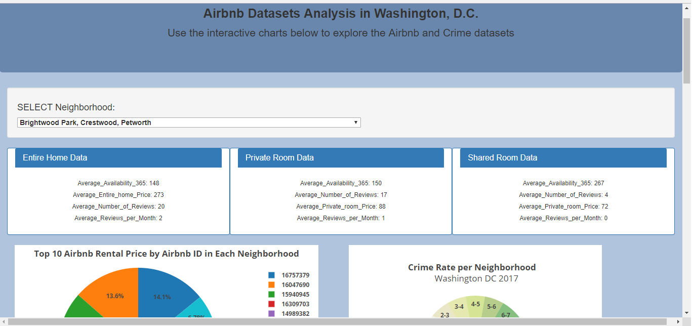
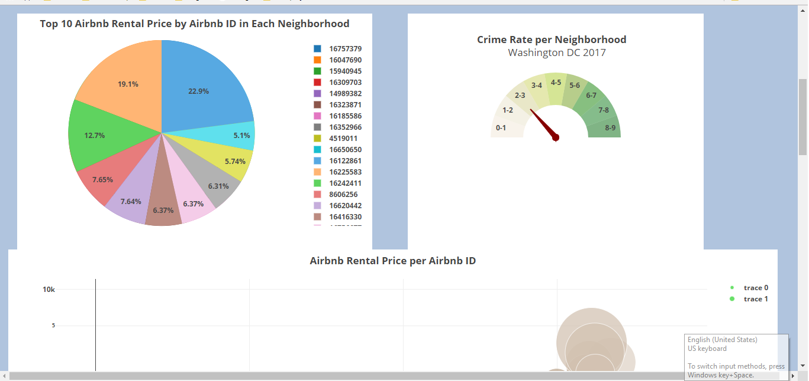
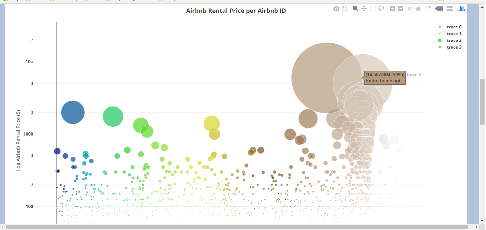
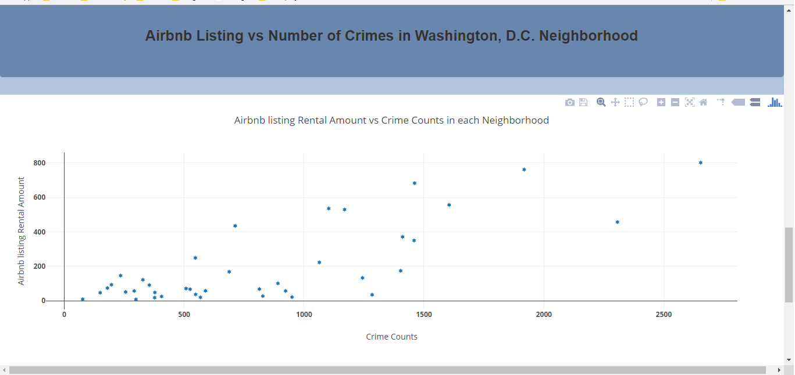

Our project will analyze data of Airbnb listings in Washington DC in May 2017.  We will create a dashboard to show variable factor of listings such as price, review, availability and crime in different neighborhoods and estimate their relationship.
Following is the data origin:

http://insideairbnb.com : listings.csv;  neighbourhoods.csv, 

http://opendata.dc.gov/datasets :  Crime_Incidents_in_2017.csv; Neighborhood_Clusters.csv

Step 1 - Flask API

1. Clean up the CSV data:  
data_engineering_airbnb.ipynb;

2. Create the SQLite database using the cleaned CSV files:         
database_engineering_create_sqlite_db.ipynb

3. Explore the SQLite data:
Sqlite explore.ipynb

4. Use Flask (App.py) to design an API for our dataset and to serve the HTML and JavaScript required for our dashboard page. 
We used the sqlite database file & SQLAlchemy inside of our Flask application code.

Finally we outputted the data as JSON in the format specified in the routes below.
•	First, we created a template called index.html for our dashboard landing page. Use the Bootstrap grid system to create the structure of the dashboard page.
•	Next, create the routes for our api.

@app.route("/")
    """Return the dashboard homepage."""

@app.route('/names')
"""List of neighborhood names;

@app.route('/crimecount/<neighbourhood>')
     """List of airbnb neighborhood crime count;
     
@app.route ('/crimerate/<neighbourhood>')
     """List of airbnb neighborhood crime rate.;
     
@app.route('/crimedata/<neighbourhood>')
"""List of crime Incidents counts and crime rate in each neighborhood;

@app.route(' /entirehome/<neighbourhood>')
"""Entire_home information for a given neighbourhood;

@app.route('/privateroom/<neighbourhood>')
    """Private_room information for a given neighbourhood;
    
@app.route('/sharedroom/<neighbourhood>')
     """Shared_room information for a given neighbourhood;
     
"""List of average price and review counts in each room_type in each neighborhood.

@app.route('/listprice/<neighbourhood>')
  """List of each Airbnb Id’s price, host-id, review, availability etc. in each neighborhood. 

Step 2 - Plotly.js

Use Plotly.js to build interactive charts for our dashboard.

•	Use the route /names to populate a dropdown select element with the list of neighborhood names.

Display the neighborhood crime from the route /crimedata/< neighborhood >
•	Display each key/value pair from the crime JSON object on the page
•	Update the crime rate for each neighborhood that is selected
Display the average price , reviews and availabilities from the route /entirehome/< neighborhood >; /privateroom/< neighborhood >; /sharedroom/< neighborhood >

•	Display each key/value pair from the “three room type” JSON object on the page
•	Update the price , reviews and availabilities for each neighborhood that is selected
Create a Bubble Chart that uses data from our routes /listprice/< neighbourhood> to plot the price vs the Airbnb_id in each neighbourhood for the selected Airbnb ID.

(We may use Highcharts as the new JS library the project required to create Bubble Chart) ;

•	Use the Airbnb_id for the x values;
•	Use the price for the y values;
•	Use the price for the marker size;
•	Use the Airbnb_id for the marker colors;

  Use the Airbnb ID data ( house information) for the text values;
•	Use Plotly.restyle to update the chart whenever a new neighbourhood is selected;

Create a PIE chart that uses data from routes /listprice/<neighbourhood>  to display the top 10 highest price in each neighbourhood. 
•	Use the price  as the values for the PIE chart;
•	Use the room_type as the labels and the hovertext for the chart;
•	Use Plotly.restyle to update the chart whenever a new sample is selected;
•	Use the neighborhood for the marker colors;
  Use the review Data for the text values;
•	Use Plotly.restyle to update the chart whenever a new sample is selected;

Create a Gauge chart that uses data from routes /crimerate/<neighbourhood>  to display the crime rate in each neighbourhood. 

Step 3 - Visualizing Data with D3 and Leaflet

